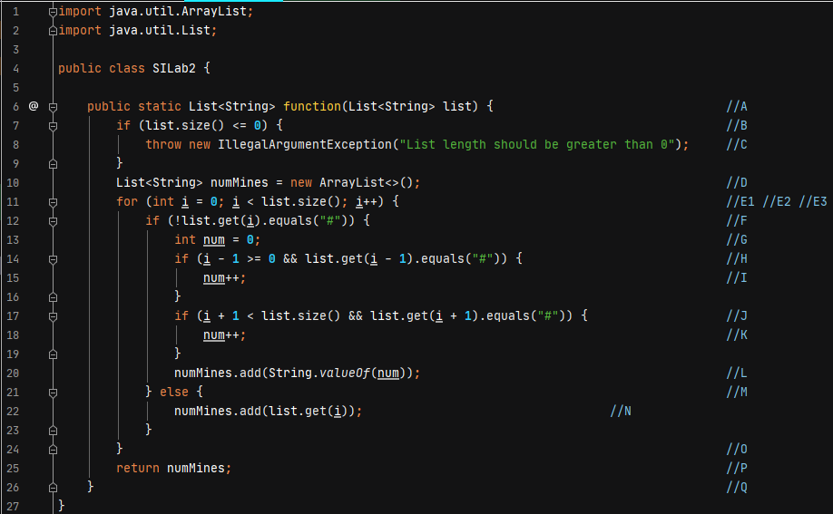

# Втора лабораториска вежба по Софтверско инженерство
## Диме Атанасов, Индекс: 171241

### Група на код: 5

# Control Flow Graph




Број на ребра: 23  
Број на јазли: 19  
Број на региони: 6  
Цикломатска комплексност: 6  
1. Цикломатска комплексност = Региони  
2. Цикломатска комплексност = Број на редикантни јазли + 1  
3. Цикломатска комплексност = Ребра - Јазли + 2  

# Multiple condition


# Every branch


# Објаснување за unit тестовите
### Multiple condition
Во тест случајот ќе се провере дали со дадената листа условите се точни. При проверката ќе видиме дека дава вредност TRUE.  
``` JAVA
Assert.assertEquals(new ArrayList<>(createNewArrayList("1", "#", "2", "#")), siLab2.function(createNewArrayList("0", "#", "0", "#")));
```
### Every branch
Во тест случајот ќе провере дали при праќање на дадената листа ќе се избројат бомбите и ќе добиеме на местото на првата нула вредност 1,
а на втората нула вредност 2.  
```JAVA
Assert.assertEquals(new ArrayList<>(createNewArrayList("1", "#", "2", "#")), siLab2.function(createNewArrayList("0", "#", "0", "#")));
```
